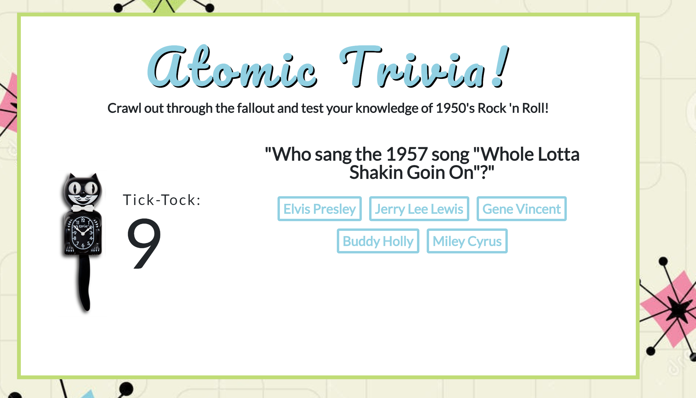

#Trivia Game
Week 5 Assignment: Trivia Game

## Atomic Trivia
 The challenge was to create a timed trivia game. Only 10 seconds were alotted to each question. After all of the questions were finished, the final scoreboard of how well you did would appear.

## Motivation
I wanted to create a trivia game that included my love of 1950's rock n' roll.  My goal was to challenge myself by having each question appear on it's own after the previous question was answered.  

## Technologies Used
- Bootstrap
- Google Fonts
- jQuery

## Getting Started
Play here: https://alyciamriley.github.io/atomic-trivia/

## Screenshots

Displays time left, question, and available answers to choose from.

## Built With

- Brackets- Text Editor
- Bootstrap- Wireframe

## Future Development

- Questions are repeating themselves. Currently working on having the code flag the questions as answered=true/false
- Track high scores via a Mongo database.
- Ultimate goal is to re-do this application into a full MERN stack app.

## Authors

* Alycia Riley
[Alycia Riley](http://www.code-retro.com)

